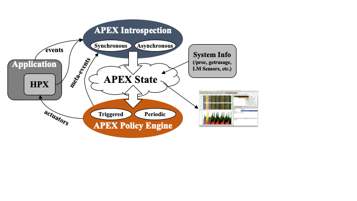

# APEX: Motivation

Frequently, software components or even entire applications run into a situation where the context of the execution environment has changed in some way (or does not meet assumptions). In those situations, the software requires some mechanism for evaluating its own performance and that of the underlying runtime system, operating system and hardware. The types of adaptation that the software wants to do could include:

* Controlling concurrency
	* to improve energy efficiency
	* for performance
* Parametric variability
	* adjust the decomposition granularity for this machine / dataset
	* choose a different algorithm for better performance/accuracy
	* choose a different preconditioner for better performance/accuracy
	* choose a different solver for better performance/accuracy
* Load Balancing
	* when to perform AGAS migration?
	* when to perform repartitioning?
	* when to perform data exchanges?
* Parallel Algorithms (for_each…) - choose a different execution model
	* separate *what* from *how*
* Address the “SLOW(ER)” performance model
	* avoid **S**tarvation
	* reduce **L**atency
	* reduce **O**verhead
	* reduce **W**aiting
	* reduce **E**nergy consumption
	* improve **R**esiliency

APEX provides both *performance awareness* and *performance adaptation*.

* APEX provides top-down and bottom-up performance mapping and feedback.
* APEX exposes node-wide resource utilization data and analysis, energy consumption, and health information in real time
	* Software can subsequently associate performance state with policy for feedback control
* APEX introspection
	* OS: track system resources, utilization, job contention, overhead
	* Runtime (e.g. HPX, OpenMP, CUDA, OpenACC, Kokkos...): track threads, queues, concurrency, remote operations, parcels, memory management
	* Application timer / counter observation

*Above: APEX architecture diagram (when linked with an HPX application). The application and runtime send events to the APEX instrumentation API, which updates the performance state. The Policy Engine executes policies that change application behavior based on rule outcomes.*

## Introspection

APEX collects data through *inspectors*. The synchronous data collection uses an event API and event *listeners*. The API includes events for:

* Initialize, terminate, new thread 
	* added to the HPX thread scheduler
	* added to the OpenMP runtime using the OMPT interface
	* added to the pthread runtime by wrapping the pthread API calls
* Timer start, stop, yield, resume 
	* added to HPX task scheduler
	* added to the OpenMP runtime using the OMPT interface
	* added to the pthread runtime by wrapping the pthread API calls
	* added to the CUDA runtime by subscribing to CUPTI callbacks and asynchronous GPU activity
	* added to the Kokkos runtime by registering for callbacks
	* added to the OpenACC runtime by registering for callbacks
* Sampled values
	* counters from HPX
	* counters from OpenMP
	* counters from CUPTI
* Custom events (meta-events)
	* useful for triggering policies

Asynchonous data collection does not rely on events, but occurs periodically.  APEX exploits access to performance data from lower stack components (i.e. the runtime) or by reading from the RCR blackboard (i.e., power, energy). Other operating system and hardware health data is collected through other interfaces:

* /proc/stat
* /proc/cpuinfo
* /proc/meminfo
* /proc/net/dev
* /proc/self/status
* lm_sensors
* power measurements
* counters from NVIDIA Monitoring Library (NVML) 

## Event Listeners

There are a number of listeners in APEX that are triggered by the events passed in through the API. For example, the **Profiling Listener** records events related to maintaining the performance state.

* Start Event: records the name/address of the timer, gets a timestamp (using rdtsc), returns a profiler handle
* Stop Event: gets a timestamp, optionally puts the profiler object in a queue for back-end processing and returns
* Sample Event: put the name & value in the queue

Internally to APEX, there is an asynchronous consumer thread that processes profiler objects and samples to build a performance profile (in HPX, this thread is processed/scheduled as an HPX thread/task), construct task graphs, and scatterplots of sampled task times.

The **TAU Listener** (used for postmortem analysis) synchronously passes all measurement events to TAU to build an offline profile or trace. TAU will also capture any other events for which it is configured, including MPI, memory, file I/O, etc.

The **concurrency listener** (also used for postmortem analysis) maintains a timeline of total concurrency, periodically sampled from  within APEX.

* Start event: push timer ID on stack
* Stop event: pop timer ID off stack

An asynchronous consumer thread periodically logs the current timer for each thread. This thread will output a concurrency data report and gnuplot script at APEX termination.

The **OTF2 listener** will construct a full event trace and write the events out to an [OTF2](https://www.vi-hps.org/projects/score-p/) archive.  OTF2 files can be visualized with tools like [Vampir](https://tu-dresden.de/zih/forschung/projekte/vampir/index?set_language=en) or [Traveler](https://github.com/hdc-arizona/traveler-integrated).  Due to the constraints of OTF2 trace collection, tasks that start on one OS thread and end on another OS thread are not supported.  Similarly, tasks/functions that are not perfectly nested are not supported by OTF2 tracing.  For those types of tasks, we recommend the Trace Event listener.

The **Trace Event listener** will construct a full event trace and write the events to one or more [Google Trace Event](https://docs.google.com/document/d/1CvAClvFfyA5R-PhYUmn5OOQtYMH4h6I0nSsKchNAySU/edit#) trace files.  The files can be visualized with the Google Chrome web browser, by navigating to the `chrome://tracing` URL.  Other tools can be used to visualize or analyze traces, like [Catapult](https://chromium.googlesource.com/catapult).  

## Policy Listener

Policies are rules that decide on outcomes based on observed state. 
Triggered policies are invoked by introspection API events.
Periodic policies are run periodically on asynchronous thread.
Polices are registered with the Policy Engine at program startup by runtime code and/or from the application.
Applications, runtimes, and the OS can register callback functions to be executed. 
Callback functions define the policy rules - “If x < y then...(take some action!)”.

* Enables runtime adaptation using introspection data
* Engages actuators across stack layers
* Is also used to involve online auto-tuning support

